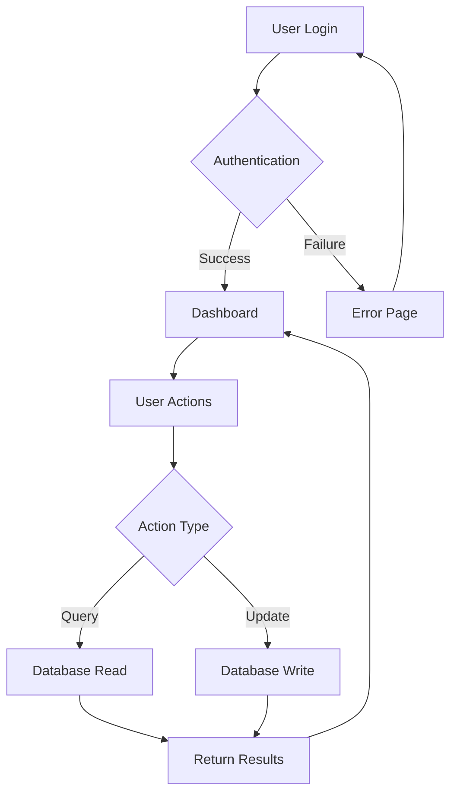
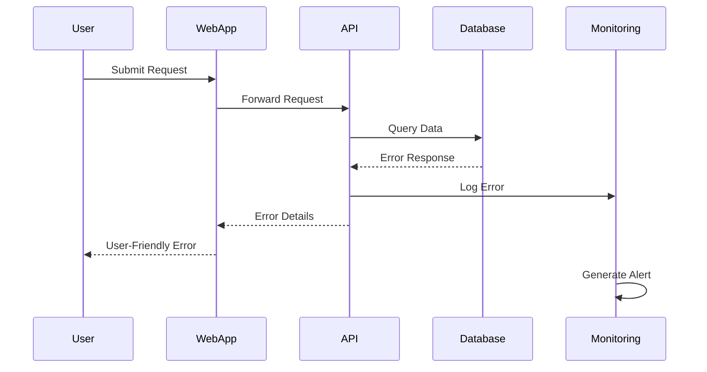

# System Architecture with Multiple Diagram Types

This RFD demonstrates the ability to use both Mermaid and D2 diagrams within the same document.

## Overview

We need to design a system that can handle multiple types of user interactions and data flows. This document uses different diagram types to illustrate various aspects of the system.

## High-Level Architecture (Mermaid)

The following flowchart shows the overall user workflow:



## System Components (D2)

Here's a detailed view of the system components and their relationships:

```d2
# System Architecture Components
web_server -> auth_service: authenticate user
auth_service -> user_db: verify credentials
auth_service -> web_server: auth token

web_server -> api_gateway: forward request
api_gateway -> service_a: route request
api_gateway -> service_b: route request
api_gateway -> service_c: route request

service_a -> cache: check cache
service_a -> primary_db: query data
service_b -> message_queue: publish event
service_c -> analytics_db: store metrics

cache.style.fill: "#ffeaa7"
primary_db.style.fill: "#74b9ff"
analytics_db.style.fill: "#fd79a8"
message_queue.style.fill: "#e17055"
```

## Data Flow (D2)

This diagram shows how data moves through the system:

```d2
users: Users {
  shape: person
  style.fill: "#6c5ce7"
}

load_balancer: Load Balancer {
  style.fill: "#a29bfe"
}

app_servers: {
  app1: App Server 1
  app2: App Server 2
  app3: App Server 3
}

database_cluster: {
  master: Master DB
  replica1: Replica 1
  replica2: Replica 2
  
  master -> replica1: sync
  master -> replica2: sync
}

users -> load_balancer: HTTP requests
load_balancer -> app_servers.app1
load_balancer -> app_servers.app2 
load_balancer -> app_servers.app3

app_servers.app1 -> database_cluster.master: write
app_servers.app2 -> database_cluster.replica1: read
app_servers.app3 -> database_cluster.replica2: read
```

## Error Handling Flow (Mermaid)

When things go wrong, here's how errors are handled:



## Deployment Architecture (D2)

Finally, here's how the system is deployed across different environments:

```d2
production: Production Environment {
  style.stroke: "#d63031"
  style.fill: "#fab1a0"
  
  web_tier: Web Tier {
    nginx1: NGINX 1
    nginx2: NGINX 2
  }
  
  app_tier: Application Tier {
    app1: App Server 1
    app2: App Server 2  
    app3: App Server 3
  }
  
  data_tier: Data Tier {
    db_master: Master DB
    db_replica: Replica DB
    redis: Redis Cache
  }
}

staging: Staging Environment {
  style.stroke: "#e17055"
  style.fill: "#fdcb6e"
  
  single_app: App Server
  staging_db: Database
}

development: Development Environment {
  style.stroke: "#00b894"
  style.fill: "#55efc4"
  
  local_app: Local App
  local_db: Local DB
}

# Connections between environments
staging -> production: deployment pipeline
development -> staging: promote changes
```

## Conclusion

This document demonstrates that both Mermaid and D2 diagrams can coexist in the same RFD, allowing authors to choose the most appropriate diagramming tool for their specific needs:

- **Mermaid** is excellent for flowcharts, sequence diagrams, and Git graphs
- **D2** excels at architectural diagrams, entity relationships, and complex layouts with custom styling

Both tools integrate seamlessly with the RFD rendering system.